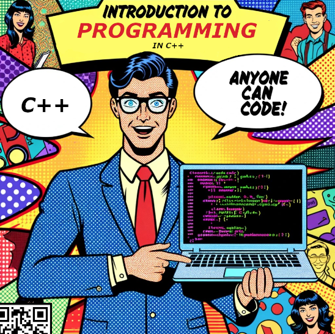

# What's in this repo?

-   Repository for CSC 100 - Introduction to Programming in C++
-   Emacs Org-mode files( `.org`) are rendered as Markdown (not on
    mobile app but works well in mobile browser).
-   Reference links in the files lead to a 404 error. You always find
    the references at the end of a file.
-   For a TOC, open the bullet point list menu

## Agenda for every session

## Syllabus for a course overview

## Practice with interactive notebooks

## Assignments and solutions

## Installation information

# How to use GitHub

-   Register and get added as a collaborator to this repo
-   Complete the GitHub starter course
-   Fork this repo to your own GitHub account
-   File access: on desktop/laptop, open `.org` files
-   Mobile file access on the mobile GitHub app (you need `.md` files,
    which you might have to create yourself)
-   Check regularly (or setup notification) for changes
-   Commit changes to your fork

# History

First offered @Lyon: Spring 2022 (Undergrad). To be offered: Summer
school 2022, Spring 2024, 2026, 2028.

